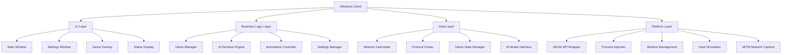
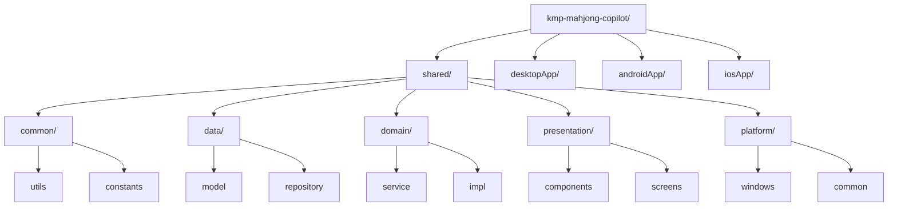

# KMP MahjongCopilot Windows 客户端开发计划

## 项目概述

基于 MahjongCopilot 项目，使用 Kotlin Multiplatform (KMP) 技术栈开发 Windows 客户端，实现智能麻将助手功能，支持自动打牌。

## 项目运行
在 compose-mpp 文件夹下运行  .\gradlew.bat :desktopApp:run

## 技术栈选择

### 核心技术
- **Kotlin Multiplatform**: 跨平台开发框架
- **Compose Multiplatform**: 现代化 UI 框架
- **Ktor**: 网络通信库
- **Kotlinx Serialization**: JSON 序列化
- **Coroutines**: 异步编程
- **SQLDelight**: 数据库操作

### Windows 特定技术
- **Windows API**: 系统级操作
- **Win32 API**: 窗口管理和输入模拟
- **Windows Runtime**: 现代 Windows API
- **mitmproxy**: 网络包捕获和拦截
- **JNA**: Java Native Access 用于调用 Windows API

## 项目架构设计

### 1. 整体架构


### 2. 模块结构


## 详细工作步骤

### 阶段 1: 项目初始化 (1-2 天)

#### 1.1 创建 KMP 项目结构
- [x] 使用 IntelliJ IDEA 创建新的 KMP 项目
- [x] 配置 Gradle 构建脚本
- [x] 设置模块依赖关系
- [x] 配置 Compose Multiplatform

#### 1.2 基础依赖配置
- [x] 添加 Ktor 客户端依赖
- [x] 配置 Kotlinx Serialization
- [x] 添加 Coroutines 支持
- [x] 配置 SQLDelight（如需要）
- [x] 添加 Windows 平台特定依赖（JNA等）

#### 1.3 项目结构设置
- [x] 创建共享模块结构
- [x] 设置桌面应用模块
- [x] 配置资源文件管理
- [x] 设置日志系统

### 阶段 2: 核心功能实现 (3-4 天)

#### 2.1 网络拦截模块
- [x] 设计网络拦截器接口
- [x] 实现基于mitmproxy的网络拦截器
- [ ] 创建 MITM 代理功能
- [ ] 实现 WebSocket 消息捕获
- [ ] 添加进程注入支持

#### 2.2 协议解析模块
- [x] 实现 Liqi 协议解析器
- [x] 创建 MJAI 协议转换器
- [ ] 添加消息队列管理
- [ ] 实现协议版本兼容性

#### 2.3 游戏状态管理
- [x] 创建游戏状态数据结构
- [x] 实现状态同步机制
- [ ] 添加游戏事件处理
- [ ] 实现状态持久化

### 阶段 3: AI 集成 (2-3 天)

#### 3.1 AI 模型接口
- [x] 设计 AI 模型抽象接口
- [x] 实现本地模型集成
- [x] 添加在线模型支持
- [x] 创建模型切换机制

#### 3.2 决策引擎
- [x] 实现 MJAI 决策逻辑
- [ ] 创建动作优先级系统
- [ ] 添加风险评估功能
- [ ] 实现决策缓存机制

#### 3.3 模型管理
- [x] 实现模型加载和卸载
- [ ] 添加模型性能监控
- [x] 创建模型配置管理
- [ ] 实现模型更新机制

### 阶段 4: 自动化功能 (2-3 天)

#### 4.1 输入模拟
- [x] 设计输入模拟接口
- [ ] 实现 Windows 输入模拟（进行中）
- [ ] 创建鼠标点击模拟
- [ ] 添加键盘输入模拟
- [ ] 实现精确坐标定位

#### 4.2 游戏操作自动化
- [x] 设计自动化服务接口
- [ ] 实现 Windows 自动化服务（进行中）
- [ ] 创建自动吃碰杠逻辑
- [ ] 添加自动立直功能
- [ ] 实现自动和牌检测

#### 4.3 游戏流程控制
- [ ] 实现游戏状态检测
- [ ] 创建操作时机判断
- [ ] 添加异常处理机制
- [ ] 实现操作确认系统

### 阶段 5: 用户界面开发 (3-4 天)

#### 5.1 主界面设计
- [x] 创建主窗口布局
- [x] 实现状态显示面板
- [x] 添加控制按钮组
- [x] 创建日志显示区域

#### 5.2 设置界面
- [x] 实现设置窗口
- [x] 添加模型配置选项
- [ ] 创建网络设置面板
- [x] 实现自动化设置

#### 5.3 游戏覆盖显示
- [ ] 实现游戏内覆盖窗口
- [ ] 创建 AI 建议显示
- [ ] 添加操作提示界面
- [ ] 实现透明度控制

#### 5.4 状态监控界面
- [x] 创建实时状态显示
- [ ] 添加性能监控面板
- [x] 实现错误信息显示
- [x] 创建操作历史记录

### 阶段 6: 系统集成 (2-3 天)

#### 6.1 Windows 系统集成
- [ ] 实现系统托盘功能
- [ ] 添加开机自启动
- [ ] 创建系统通知
- [ ] 实现权限管理

#### 6.2 进程管理
- [ ] 实现目标进程检测
- [ ] 创建进程注入功能
- [ ] 添加进程监控
- [ ] 实现异常恢复

#### 6.3 配置管理
- [x] 实现配置文件管理
- [ ] 添加设置导入导出
- [x] 创建配置验证
- [ ] 实现配置备份

### 阶段 7: 测试和优化 (2-3 天)

#### 7.1 功能测试
- [ ] 单元测试编写
- [ ] 集成测试实现
- [ ] 性能测试
- [ ] 兼容性测试

#### 7.2 用户体验优化
- [ ] 界面响应优化
- [ ] 内存使用优化
- [ ] CPU 占用优化
- [ ] 网络延迟优化

#### 7.3 错误处理
- [ ] 异常处理完善
- [ ] 错误日志记录
- [ ] 崩溃恢复机制
- [ ] 用户反馈系统

## 技术实现细节

### 1. 网络拦截实现
```kotlin
// 基于mitmproxy的网络拦截器
class MitmNetworkInterceptor {
    fun startInterception(port: Int)
    fun stopInterception()
    fun captureWebSocketMessages(): Flow<WebSocketMessage>
}

// MITM 代理实现
class MitmProxy {
    fun startProxy(port: Int, mode: ProxyMode)
    fun installCertificate()
    fun forwardMessages(): Flow<NetworkMessage>
}
```

### 2. 协议解析实现
```kotlin
// Liqi 协议解析器
class LiqiProtocolParser {
    fun parseMessage(data: ByteArray): LiqiMessage?
    fun convertToMjai(liqiMessage: LiqiMessage): MjaiMessage?
}

// MJAI 协议处理器
class MjaiProtocolHandler {
    fun processGameState(mjaiMessage: MjaiMessage)
    fun generateAction(gameState: GameState): MjaiAction?
}
```

### 3. AI 模型集成
```kotlin
// AI 模型接口
interface AiModel {
    suspend fun loadModel(modelPath: String)
    suspend fun predict(gameState: GameState): MjaiAction
    suspend fun unloadModel()
}

// 本地模型实现
class LocalAiModel : AiModel {
    // 使用 libriichi 或类似库
}

// 在线模型实现
class OnlineAiModel : AiModel {
    // 通过 HTTP API 调用在线服务
}
```

### 4. 自动化控制
```kotlin
// Windows 输入模拟
class WindowsInputSimulator {
    fun clickAt(x: Int, y: Int)
    fun sendKey(keyCode: Int)
    fun dragFromTo(from: Point, to: Point)
}

// 游戏操作自动化
class GameAutomation {
    fun autoDiscard(tile: Tile)
    fun autoCall(action: CallAction)
    fun autoReach()
    fun autoAgari()
}
```

## 开发环境要求

### 开发工具
- **IntelliJ IDEA**: 2023.3 或更高版本
- **Android Studio**: 用于 Android 模块（可选）
- **Visual Studio**: 用于 Windows 特定功能
- **Git**: 版本控制

### 系统要求
- **Windows 10/11**: 目标平台
- **JDK 17+**: Kotlin 编译环境
- **Visual C++ Redistributable**: Windows API 支持
- **mitmproxy**: 网络包捕获支持

### 依赖库
- **Kotlin**: 1.9.0+
- **Compose Multiplatform**: 1.5.0+
- **Ktor**: 2.3.0+
- **Kotlinx Serialization**: 1.5.0+
- **Coroutines**: 1.7.0+
- **JNA**: 5.13.0+
- **mitmproxy**: 9.0.0+

## 风险评估和缓解

### 技术风险
1. **Windows API 兼容性**: 不同 Windows 版本可能存在差异
   - 缓解: 使用 Windows Runtime API，提供兼容性检测
   
2. **网络拦截稳定性**: 可能被安全软件拦截
   - 缓解: 提供白名单配置，使用系统级权限

3. **游戏更新兼容性**: 游戏更新可能破坏协议解析
   - 缓解: 实现协议版本检测，提供自动更新机制

### 法律风险
1. **游戏服务条款**: 可能违反游戏服务条款
   - 缓解: 提供用户协议，明确使用风险

2. **自动化工具限制**: 可能被游戏反作弊系统检测
   - 缓解: 实现人性化操作模拟，添加随机延迟

## 项目里程碑

### 里程碑 1: 基础框架 (已完成)
- 完成项目初始化和基础架构
- 实现基于mitmproxy的网络拦截功能
- 完成协议解析基础框架

### 里程碑 2: 核心功能 (进行中)
- 完成游戏状态管理
- 实现 AI 模型集成
- 完成基本的自动化功能

### 里程碑 3: Windows平台实现 (计划中)
- 完成Windows网络拦截真实实现
- 实现Windows输入模拟
- 完成游戏自动化功能

### 里程碑 4: 用户界面完善 (计划中)
- 完善主界面功能
- 实现设置和配置功能
- 完成游戏覆盖显示

### 里程碑 5: 系统集成和测试 (计划中)
- 完成Windows系统集成
- 实现完整的自动化流程
- 完成测试和优化

## 后续扩展计划

### 短期扩展
- 支持更多麻将游戏平台
- 添加统计分析功能
- 实现云端配置同步

### 长期扩展
- 支持移动端平台
- 添加机器学习优化
- 实现社区功能

## 总结

这个 KMP MahjongCopilot Windows 客户端项目将结合现代 Kotlin 技术栈和 MahjongCopilot 的核心功能，提供一个功能完整、用户友好的智能麻将助手。通过分阶段开发和迭代优化，确保项目的稳定性和可维护性。

Windows平台的实现重点关注真实的网络拦截和输入模拟功能，这将使Saki项目相比原版MahjongCopilot具有更强的实用性和兼容性。使用mitmproxy实现网络拦截与MahjongCopilot保持一致，确保了技术方案的成熟性和可靠性。